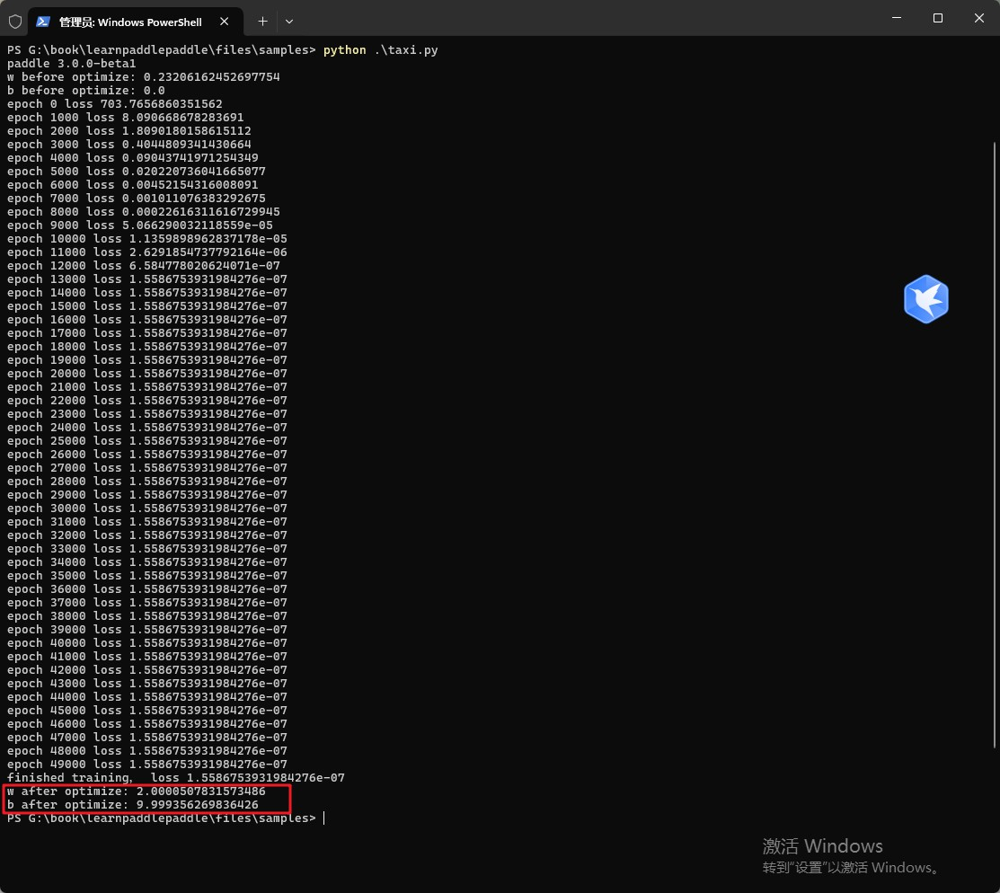

在PaddlePaddle中，‌epoch指的是训练时所有训练数据集都训练过一次的过程。‌

在深度学习的训练过程中，‌epoch是一个重要的概念，‌它表示整个训练数据集被模型遍历一次的过程。‌具体来说，‌当模型对训练集中的所有样本进行了一次前向传播和后向传播（‌即参数更新）‌后，‌就完成了一个epoch的训练。‌在这个过程中，‌模型会根据损失函数计算出的误差调整其权重，‌以优化模型性能，‌使其更好地拟合训练数据。‌

此外，‌与epoch相关的概念还有batch_size和iteration。‌Batch_size指的是在每次训练迭代中使用的样本数量，‌而iteration则表示模型在一个epoch内进行的训练迭代次数，‌即完成一次epoch所需的batch个数。‌这些概念共同构成了深度学习训练过程中的基本框架，‌对于理解模型的训练进度和性能至关重要1。‌

可以看到epoch增加到了50000，但是实际上在13000的时候就已经是最后的值了。

不管怎么样，都得不到一模一样的值的。

这可能是float的精度问题。